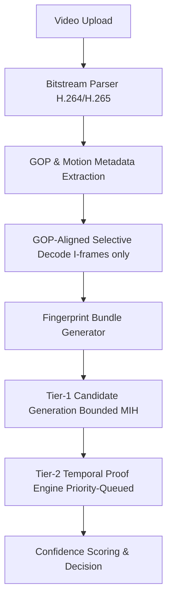

# Telescope
**Internet-Scale Video Copyright Detection Engine**
*Architecture Version: v4.3 (Final, Failure-Mode Complete)*

## 1. Executive Summary

Telescope is a deterministic, systems-first video copyright detection engine designed to operate at internet scale (10¹⁰+ fingerprints) under hostile, adversarial, and bursty workloads.

The system is engineered to survive:
- Zipfian data skew
- Tail-latency amplification
- Disk IOPS starvation
- Decoder CPU explosions
- Viral/meme storms
- Queue backpressure cascades

Unlike ML-first systems, Telescope prioritizes:
- Bounded computation
- Predictable latency
- Explainable decisions
- Cost control at scale

v4.3 represents the final structurally hardened version. There are no remaining unbounded failure paths.

## 2. Core Architectural Invariants (Non-Negotiable)

These rules are enforced at design and runtime.

- **No unbounded scans**
- **No unbounded retries or queues**
- **No dependence on the slowest node**
- **No single-signal decisions**
- **No real-time global coordination**
- **Failure must be selective, never global**

If a component violates these, it is rejected by design.

## 3. High-Level System Architecture

Each stage is:
- Horizontally scalable
- Independently bounded
- Failure-isolated

## 4. Ingestion & Decode Pipeline (Ingress Control)

### 4.1 The Ingress Problem
At scale, pixel decoding is the dominant cost—not hashing, not indexing. Decoding every frame is financially and operationally infeasible.

### 4.2 Bitstream-Level Processing (Default Path)
Telescope parses compressed video bitstreams directly to extract:
- Motion vectors
- Macroblock types
- GOP structure
- I / P / B frame markers
- Quantization parameters

This requires entropy decoding only, not full reconstruction.

### 4.3 GOP-Aligned Decode Policy (Hard Rule)
The system never decodes non-I-frames by request.
- **Why**: Arbitrary timestamp seeks force decoding from the last I-frame (hidden O(N) CPU costs).
- **Implementation**:
    - All I-frame timestamps are recorded during parsing
    - Sampling snaps to nearest I-frame
    - Structural hashes are computed only on I-frames
- **Result**: Decoder CPU ↓ 50–70%, No seek-wait stalls, Deterministic decode cost.

### 4.4 Two-Stage Decode Strategy
- **Stage A — Default (Cheap)**: Bitstream parsing, Motion energy profiles, Scene boundary hints, Motion tokens generated. No RGB frames allocated.
- **Stage B — Escalation (Selective)**: Triggered only if Tier-1 admits a candidate, Short-video mode is active, or High-entropy region detected.

## 5. Fingerprint Bundle Design

Each sampled I-frame produces a Fingerprint Bundle, stored and queried as a single atomic unit.

### 5.1 Signals Included
| Signal | Purpose |
| :--- | :--- |
| Structural Hash (pHash-like) | Global layout |
| Edge Hash (dHash-like) | Lighting robustness |
| Color Signature (low-bin HSV) | Prevent grayscale collisions |
| Motion Token (bitstream-derived) | Temporal rhythm |

### 5.2 Canonicalization
For robustness, multiple variants are evaluated: Original, Horizontal mirror, Border-masked (letterbox removal), Center-crop (~90%).
Only the canonical minimum representation is stored.

## 6. Tier-1: Candidate Generation (Scalability-Critical)

### 6.1 Multi-Index Hashing (MIH)
Each 64-bit hash is split into 4 × 16-bit segments. Each segment maps to a posting list: `segment_value → [(video_id, timestamp)]`.

### 6.2 k-of-n Admission Gate
A candidate passes Tier-1 only if:
- ≥2 segments match within the same signal
- OR ≥1 segment matches across ≥2 different signals

### 6.3 Zipf’s Law Protection (Mandatory)
- **Posting List Capping**: If a segment appears in more than X videos, it is moved to a Global Stop-List and never queried at runtime.
- **Semi-Hot Segments**: Physically sharded to guarantee maximum scan size.
- **Invariant**: No Tier-1 query scans an unbounded posting list.

### 6.4 Tail-Latency Control (Hedged Requests)
Tier-1 queries fan out to many shards. To prevent stragglers:
- Track rolling median latency per shard.
- If no response within 1.5 × median, issue hedged request to a replica.
- First response wins. Late responses dropped.

### 6.5 Tier-1 Aggregator Contract
Aggregator does not wait for all shards. Proceeds once confidence threshold is met. Aborts remaining requests aggressively.

## 7. Short-Video Detection Mode (≤30s)

Short-form content is a distinct statistical regime.
- **Anchor Frames**: Sampling rate ×3. Only high-entropy I-frames.
- **Tightened Gates**: k-of-n → k+2. Cross-signal agreement mandatory.

## 8. Tier-2: Temporal Proof Engine

### 8.1 Core Principle
Similarity is insufficient. Temporal consistency is the proof.

### 8.2 Delta Consensus Model
For each candidate hit: `Δ = T_original − T_suspect`.
- Legitimate reuse → vertical spike in Δ histogram.
- Adversarial noise → flat distribution.

### 8.3 Deterministic Pre-Gate (Mandatory)
Before any regression:
- Build Δ histogram.
- If max bin density < threshold Z: Terminate immediately.

### 8.4 Conditional Robust Regression
Only if density gate passes:
- Fit `y = m x + c`
- Accept if: Inliers ≥ threshold, m ∈ [0.85, 1.15], Temporal gaps ≤ tolerance.

## 9. Tier-2 Backpressure Control (v4.3 Final Fix)

### 9.1 The Backpressure Problem
During viral/meme events:
- Tier-1 can emit tens of thousands of valid candidates/sec.
- Tier-2 can saturate on histogram construction alone.

### 9.2 Signal Rarity Score (SRS)
Each Tier-1 candidate is assigned a Signal Rarity Score based on segment entropy, cross-signal agreement, etc.

### 9.3 Priority Queue Admission (Mandatory)
Tier-2 is a priority queue, ordered by SRS.
If Tier-2 queue depth > threshold OR Tier-2 P99 latency > 200ms OR Tier-2 CPU utilization > X%:
- Drop lowest-SRS candidates first.
- No retries. No backpressure upstream.

## 10. Coverage & Confidence Enforcement

A match is valid only if one or more holds:
- ≥ X seconds aligned (long-form)
- ≥ Y% of suspect video covered
- ≥ Z distinct scenes aligned

### 10.1 Final Confidence Score
Composite score ∈ [0, 1], combining Signal diversity, Temporal continuity, Coverage, Alignment strength, and Segment rarity.

## 11. Entropy & Frequency Management (Update-Storm Safe)

- **Online Path**: In-memory Count-Min Sketch, Lock-free, Per shard.
- **Offline Recalibration**: Every N hours, Merge sketches, Recompute entropy, Update stop-lists.

## 12. Index Storage & Memory Efficiency

- **Signature Co-location**: All signals for a fingerprint bundle sorted contiguously.
- **Compressed Inverted Index**: Video IDs sorted, Delta-encoded, VLQ compressed.
